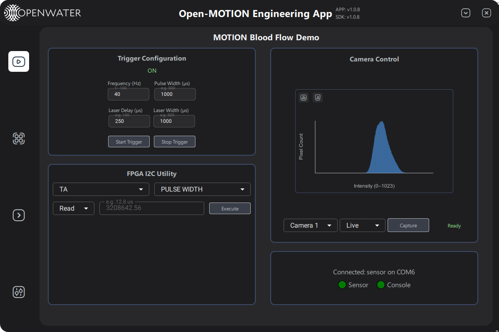

# OpenMOTION Test Application

Python example UI for OPEN Motion used for Hardware Testing and Basic Usage



## Installation

### Prerequisites
- **Python 3.9 or later**: Make sure you have Python 3.9 or later installed on your system. You can download it from the [official Python website](https://www.python.org/downloads/).

### Steps to Set Up the Project
1. **Clone the repository and Install Required Packages**:
   ```bash
   git clone https://github.com/OpenwaterHealth/OpenMOTION-TestAPP.git
   cd OpenMOTION-TestAPP
   pip install -r requirements.txt
   ```

2. **Install OpenLIFU Python**
   ```bash
   https://github.com/OpenwaterHealth/OpenMOTION-TestAPP
   ```

3. **Run application**
   requires OpenMOTION-Pylib to be installed or referenced prior to running main.py

   ```bash
   python main.py